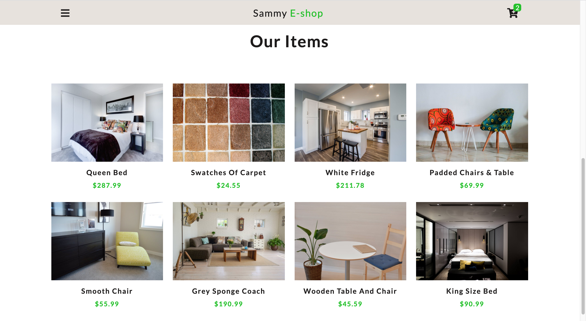

# Sammy E-shop


# Table of Contents

- [SammyE-shop](#sammye-shop)
  * [Description](#description)
  * [Screenshots](#screenshots)
  * [Requirements](#requirements)
  * [Usage](#usage)
  * [Demo](#demo)
  * [Test](#test)


## Description

This is a personal E-commerce App, built using HTML and CSS, Javascript, contentful, and netlify. 

This is an online shopping app where users can view existing products with no need to sign up or log in. To add items in the app, I have used `contentful`. To learn more about contentful, click [here](https://app.contentful.com/). Any user can select any of the existing products and buy them. This app does not contain any stripe feature.


## Screenshots


## Requirements

No dependency is required to run this application


## Usage

- Clone the repo and enter the project folder
```
git clone https://github.com/CornetS28/sammyE-Shop
cd sammyE-Shop
```
- check for the index.html file, righ click on it, and click on `open with Live Server`
 
 ## Demo
 If you want to view the live version of this app, simply click on the following link: 
 
  [Sammy E-Shop](https://sammy-e-shop-with-javascript.netlify.app/)
  
## Test
No Test has been written yet for this project. This will come soon.